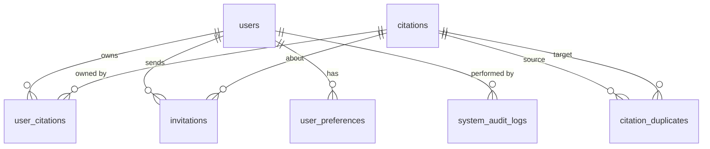

# Database Schema

SQLite database with WAL mode and foreign keys enforced.

**File**: `citation_manager.sqlite` (project root)

---

## Entity Relationship Diagram



---

## Tables

### `users`

| Column | Type | Constraints | Notes |
|--------|------|-------------|-------|
| `id` | TEXT | PRIMARY KEY | UUID |
| `email` | TEXT | UNIQUE NOT NULL | Must match whitelisted domain |
| `first_name` | TEXT | | |
| `last_name` | TEXT | | |
| `password_hash` | TEXT | NOT NULL | bcrypt hashed |
| `role` | TEXT | DEFAULT 'user' | `user` or `admin` |
| `created_at` | DATETIME | DEFAULT CURRENT_TIMESTAMP | |

### `citations`

| Column | Type | Constraints | Notes |
|--------|------|-------------|-------|
| `id` | TEXT | PRIMARY KEY | UUID |
| `title` | TEXT | NOT NULL | Paper/book title |
| `authors` | TEXT | NOT NULL | **JSON array** of `{ lastName, firstName }` objects |
| `year` | INTEGER | nullable | Publication year |
| `journal_or_publisher` | TEXT | nullable | Journal name or publisher |
| `volume` | TEXT | nullable | |
| `issue` | TEXT | nullable | |
| `pages` | TEXT | nullable | |
| `doi` | TEXT | nullable | Digital Object Identifier |
| `url` | TEXT | nullable | |
| `pub_type` | TEXT | DEFAULT 'article' | `article`, `book`, `conference`, `thesis`, `webpage` |
| `abstract` | TEXT | nullable | Paper abstract |
| `raw_source` | TEXT | nullable | Original import source data |
| `created_at` | DATETIME | DEFAULT CURRENT_TIMESTAMP | |

> **Important**: The `authors` column stores a **JSON string**, not relational data. Parse with `JSON.parse()`. Example value: `[{"lastName":"Smith","firstName":"John"},{"lastName":"Doe","firstName":"Jane"}]`

### `user_citations` (Junction Table)

| Column | Type | Constraints |
|--------|------|-------------|
| `user_id` | TEXT | NOT NULL, FK → users(id) ON DELETE CASCADE |
| `citation_id` | TEXT | NOT NULL, FK → citations(id) ON DELETE CASCADE |
| `created_at` | DATETIME | DEFAULT CURRENT_TIMESTAMP |

**Primary Key**: `(user_id, citation_id)` — composite. One user can't own the same citation twice.

### `whitelisted_domains`

| Column | Type | Constraints | Notes |
|--------|------|-------------|-------|
| `id` | TEXT | PRIMARY KEY | |
| `domain` | TEXT | UNIQUE NOT NULL | e.g. `bogazici.edu.tr`, `*.ac.uk` |
| `policy_type` | TEXT | DEFAULT 'EXACT' | `EXACT` or `WILDCARD` |
| `created_at` | DATETIME | DEFAULT CURRENT_TIMESTAMP | |

### `invitations`

| Column | Type | Constraints |
|--------|------|-------------|
| `id` | TEXT | PRIMARY KEY |
| `citation_id` | TEXT | NOT NULL, FK → citations(id) ON DELETE CASCADE |
| `inviter_user_id` | TEXT | NOT NULL, FK → users(id) ON DELETE CASCADE |
| `invited_email` | TEXT | NOT NULL |
| `status` | TEXT | DEFAULT 'pending' |
| `created_at` | DATETIME | DEFAULT CURRENT_TIMESTAMP |

### `user_preferences`

| Column | Type | Constraints | Default |
|--------|------|-------------|---------|
| `user_id` | TEXT | PRIMARY KEY, FK → users(id) ON DELETE CASCADE | |
| `default_csl_style` | TEXT | | `APA7` |
| `default_in_text_mode` | TEXT | | `parenthetical` |
| `theme_mode` | TEXT | | `light` |
| `view_density` | TEXT | | `card` |
| `default_export_format` | TEXT | | `BibTeX` |
| `export_include_abstract` | INTEGER | | `1` |
| `updated_at` | DATETIME | DEFAULT CURRENT_TIMESTAMP | |

### `system_audit_logs`

| Column | Type | Constraints |
|--------|------|-------------|
| `id` | TEXT | PRIMARY KEY |
| `admin_id` | TEXT | NOT NULL |
| `action` | TEXT | NOT NULL |
| `target_entity` | TEXT | NOT NULL |
| `details` | TEXT | nullable |
| `created_at` | DATETIME | DEFAULT CURRENT_TIMESTAMP |

### `citation_duplicates`

| Column | Type | Constraints |
|--------|------|-------------|
| `id` | TEXT | PRIMARY KEY |
| `source_citation_id` | TEXT | NOT NULL, FK → citations(id) ON DELETE CASCADE |
| `target_citation_id` | TEXT | NOT NULL, FK → citations(id) ON DELETE CASCADE |
| `match_score` | REAL | NOT NULL |
| `match_reason` | TEXT | NOT NULL |
| `status` | TEXT | DEFAULT 'pending' |
| `created_at` | DATETIME | DEFAULT CURRENT_TIMESTAMP |

---

## Key Queries

### Scope Counts (filter-aware)
```sql
-- My citations (with active filters)
SELECT COUNT(*) FROM citations c
WHERE c.id IN (SELECT citation_id FROM user_citations WHERE user_id = ?)
  AND [common filter conditions];

-- Unowned citations (with active filters)
SELECT COUNT(*) FROM citations c
WHERE c.id NOT IN (SELECT citation_id FROM user_citations)
  AND [common filter conditions];

-- All citations (with active filters)
SELECT COUNT(*) FROM citations c
WHERE [common filter conditions];
```

### Ownership Check
```sql
SELECT 1 FROM user_citations WHERE user_id = ? AND citation_id = ?
```

### Author Parsing
The `authors` column is always filtered via `LOWER(c.authors) LIKE ?` with `%pattern%` — this searches within the JSON string directly rather than parsing JSON in SQL.

---

## Seeded Default Domains

| Domain | Policy |
|--------|--------|
| `bogazici.edu.tr` | EXACT |
| `gmail.com` | EXACT |
| `*.ac.uk` | WILDCARD |
